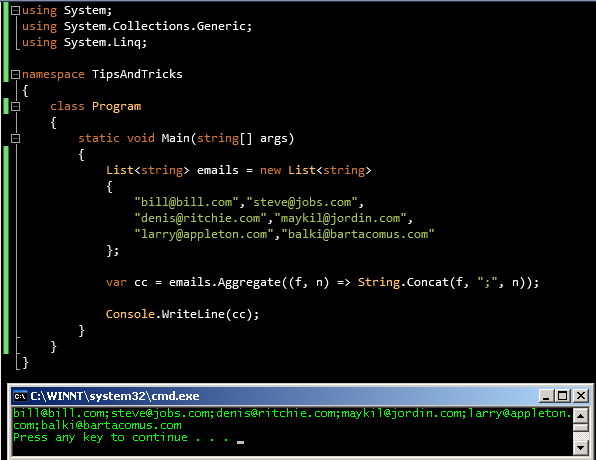

# Tek Fotoluk İpucu 51 - String Birleştirirken Aggregate Kullanmak
Merhaba Arkadaşlar,

Diyelim ki elinizde n sayıda e-mail adresi var ve bunları kod içerisinde string tipinden generic bir List koleksiyonunda saklıyorsunuz. Bu mail adreslerinin tamamına toplu olarak mail göndermek isterseniz genellikle aralarına virgül veya noktalı virgül işareti koyarak birleştirmeniz gerekir. Aslında bu amaçla basit bir for döngüsü/foreach döngüsü işinize yarayacaktır. Ya da aşağıdaki gibi LINQ'in getirdiği bazı extension method nimetlerinden de yararlanabilirsiniz

Görüşmek üzere

