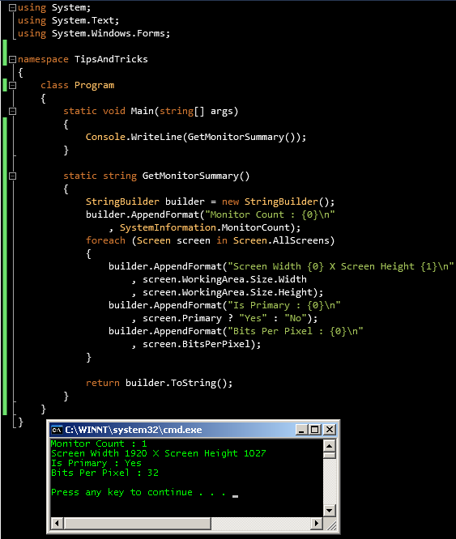

# Tek Fotoluk İpucu 52 - Monitor Bilgileri
Merhaba Arkadaşlar,

Malum Visual Studio dahil pek çok programın birden fazla monitor desteği bulunmakta. Hatta geliştirdiğimiz uygulamaların çoğu birden fazla monitor desteği olacak şekilde yapılandırılabiliyor. Peki sistemde yüklü kaç monitor var, bunların çözünürlükleri, pixel başına byte değerleri nelerdir, öğrenebilir miyiz? Tabi ki

