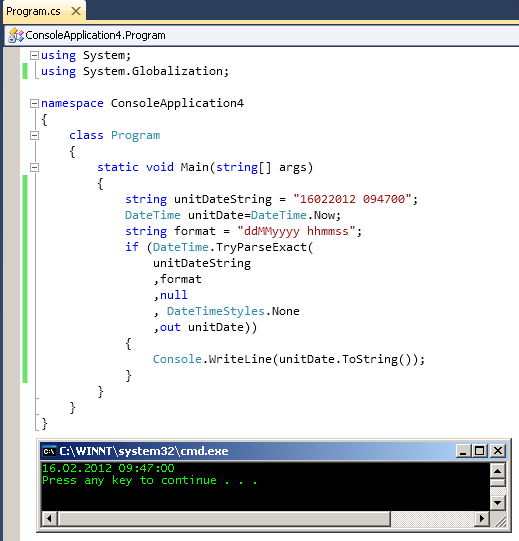

# Tek Fotoluk İpucu 53 - Tarih Dönüşümünde Extract Kullanımı
Merhaba Arkadaşlar,

Diyelim ki text tabanlı veya benzeri bir dosyadan satır bazlı veri okuma ve aktarma işlemi gerçekleştiriyorsunuz. Bu veri dosyasındaki alanlardan birisinde 16022012 094500 gibi bir tarih bilgisi tutulduğunu varsayalım. Kodunuzun bu alanı DateTime tipine çevirmesi işleminde Try kontrolünü kendi içinde yapan ve string içerisindeki harflerin tarihsel anlamda neye karşılık geldiğini belirtmemize yarayan bir fonksiyon olduğunu biliyor muydunuz?

