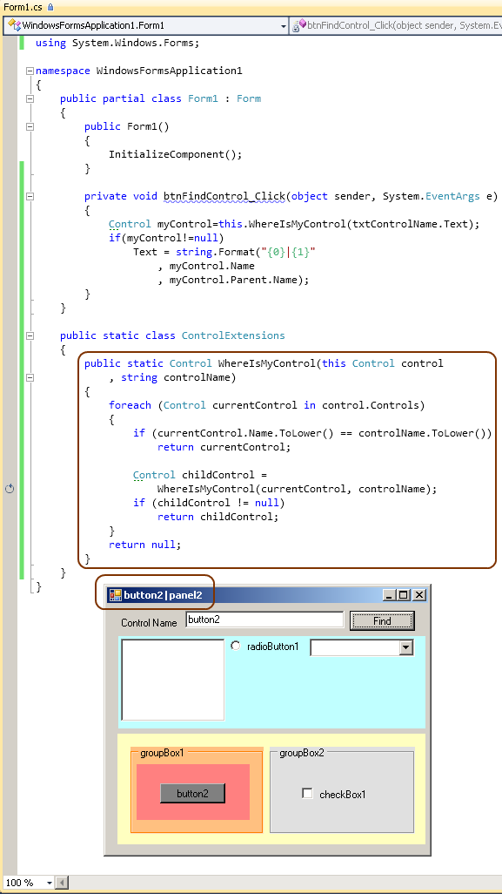

# Tek Fotoluk İpucu 54 - Control Nerede?
Merhaba Arkadaşlar,

Diyelim ki çalışma zamanında, Windows Forms'un içerisindeki bir kontrolü (Control tipinden bir nesne örneğini) kodla buldurmanız ve üzerinde bir işlem yaptırmanız gerekiyor. Hatta formunuzun da, otomatik olarak bir veri kaynağına göre üretildiğini ve kontrollerin de iç içe gelecek şekilde yerleştirildiğini düşünün. Kodun belirli bir kontrol üzerinde işlem yapması için önce onu bulması gerekir değil mi? Ancak control ağaç yapısının da çalışma zamanında üretilmesi söz konusudur.

Ne yaparsınız? Bir Recursive metod ile bunu çözebilir misiniz? Hatta bunu bir Extension Method olarak tasarlayıp herhangibir Container Control için de çalışacak hale getirmek istemez misiniz? Buyrun öyleyse

Bir sonraki ipucunda görüşmek dileğiyle

