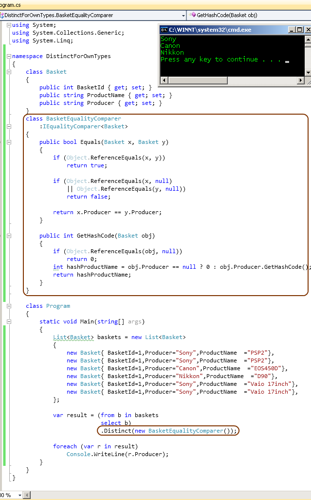

# Tek Fotoluk İpucu 55 - Distinct ve IEqualityComparer
Merhaba Arkadaşlar,

Diyelim ki elinizde kendi tipinize ait generic bir liste ve bu liste içerisinde veri bazında tekrarlı nesne örnekleri var. Örneğin bir ürün listesi ve bu liste içerisinde aynı üretici adına ait pek çok kayıt olduğunu düşünelim. Normal şartlar altında SQL tarafında yazacağınız basit bir sorgu ile üreticilerin adlarını tekrarsız olarak elde edebilirsiniz. Peki LINQ tarafındaki Distinct fonksiyonunu kullanarak aynı işi yapabilir misiniz? Ufak bir interface'den yararlanarak bu sorunu aşmanız mümkün. Sorun diyoruz, çünkü interface implementasyonunu yapmassanız, Distinct genişletme metodu (Extension Method) yine çalışır ama beklemediğiniz şekilde

Bir diğer ipucunda görüşmek dileğiyle

