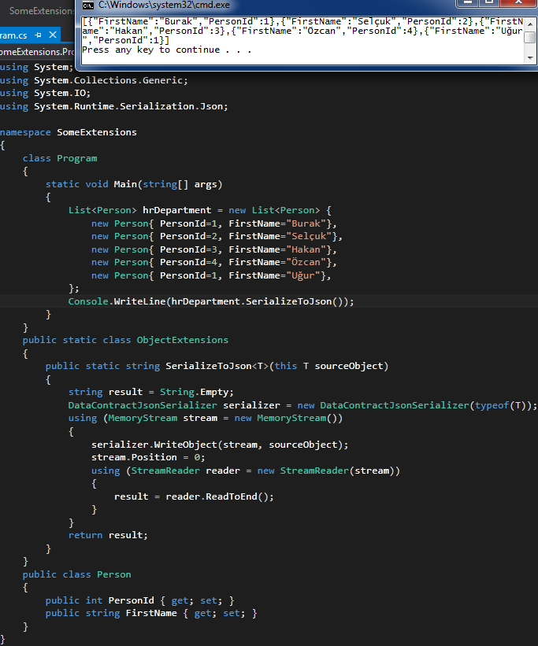

# Tek Fotoluk İpucu 59–Nesneyi JSON String Olarak Serileştirmek
Merhaba Arkadaşlar,

Diyelimki generic T tipine yazacağınız bir Extension metod ile, JSON formatında serileştirme işlemi yaptırmak ve serileştirme sonucunuda string olarak geriye döndürmek istiyorsunuz. Ne yaparsınız? Aşağıdaki fotoğraf bir ip ucu verebilir mi?

Bir başka ip ucunda görüşmek dileğiyle.
