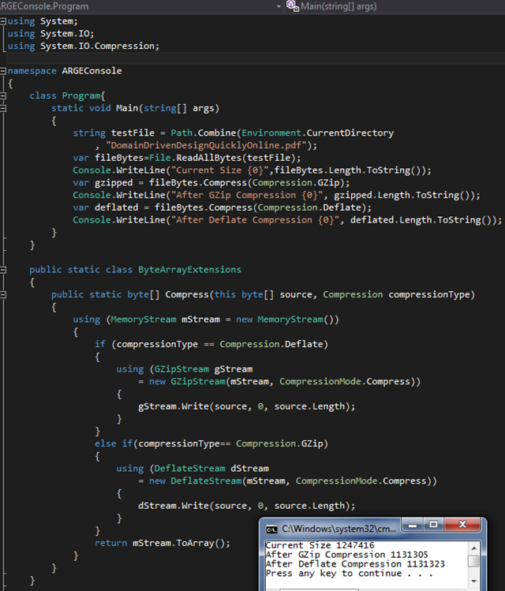

# Tek Fotoluk İpucu 62–Byte Array için Sıkıştırma
Merhaba Arkadaşlar,

Kod içerisinde bir yerlerde öyle ya da böyle elde ettiğiniz ama boyutu azcık da olsa küçülebilse dediğiniz byte tipinden array’ ler olduğunu düşünün. Kimi zaman bir dosyanın içeriği olabileceği gibi, sistem içerisinde üretilmiş bir byte dizisi bile olabilir bu. Peki söz konusu içeriği var olan GZip veya Deflate algoritmalarına göre sıkıştırmak isterseniz

Aşağıdaki gibi bir Extension Method eminim ki işinize yarayacaktır.

Bir başka ipucunda görüşmek dileğiyle.
