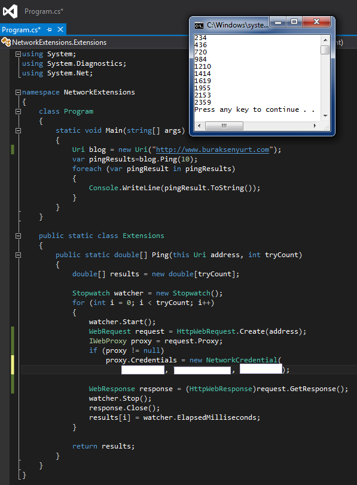

# Tek Fotoluk İpucu 63–Uri Üzerinden Ping Sürelerine Bakmak
Merhaba Arkadaşlar,

Hani bazen komut satırından bir URL adresine talep gönderip cevap sürelerine bakarız. Peki kod tarafından bu işi nasıl taklit edebiliriz? Örneğin Uri tipine bir Extension Method dahil etsek nasıl olur? Buyrun öyleyse

> NetworkCredential parametreleri sırasıya Username, Password ve Domain olarak set edilir. Eğer proxy kullanılıyorsa.

Bir başka ip ucunda görüşmek dileğiyle.
