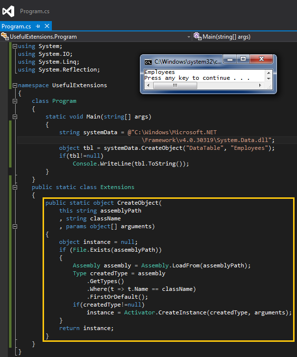

# Tek Fotoluk İpucu 64 – Assembly Adresinden Object Üretmek
Merhaba Arkadaşlar,

Bazen reflection tekniklerini kullanarak harici assembly’ lar içerisinden bulduğumuz tiplerin örneklerini ürettirme ihtiyacı duyabiliriz. Bunun için kullanabileceğimiz pek çok yol vardır aslında. Örneğin tipin bulunduğu Assembly dosya adresini tutan bir string değişken üzerinden dahi istenilen nesne örneğinin üretilmesini sağlayabiliriz. Nasıl mı?

Bir başka ip ucunda görüşmek dileğiyle.
