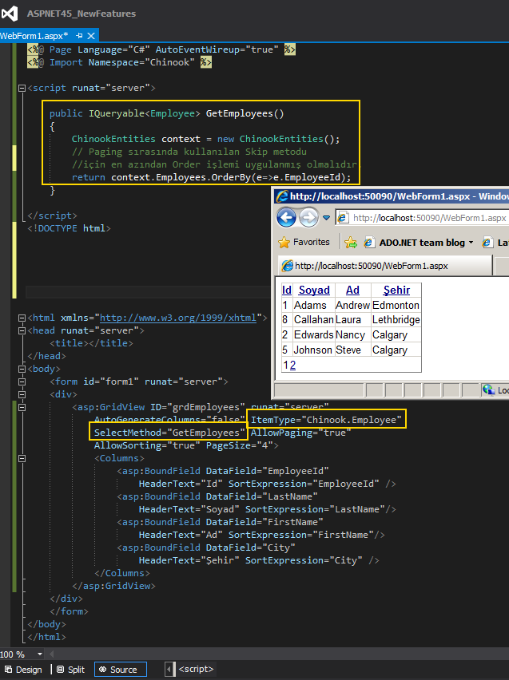

# Tek Fotoluk İpucu 67.5–Asp.Net 4.5 No More DataBind
Merhaba Arkadaşlar,

Asp.Net 4.5 Web Forms tarafında gelen yeniliklerden birisi de, veri bağlı kontrolleri IQueryable veya IEnumerable tipinden arayüz referanslarına bağlarken DataBind fonksiyon çağrısı yapılması zorunluluğu olmamasıdır. Bu sayede Markup tarafında sadece Select metodunun bildirilmesi yeterli olmaktadır. Aşağıdaki ekran görüntüsünde olduğu gibi

[Örnekte kullanılan Chinook isim alanı, meşhur Chinook veritabanının Entity Framework tabanlı modelinin oluşturulduğu yerdir]

Bir başka ipucunda görüşmek dileğiyle

