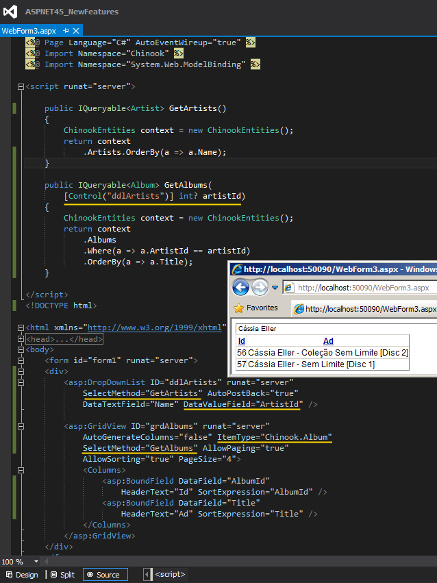

# Tek Fotoluk İpucu 67.75–Asp.Net 4.5 ControlAttribute
Merhaba Arkadaşlar,

Asp.Net 4.5 ile gelen önemli tiplerden birisi de, System.Web.ModelBinding isim alanı (System.Web.dll assembly’ ı içerisindedir) altında yer alan ControlAttribute niteliğidir (Attribute). Metod parametrelerine uygulanabilen bu nitelik ile, veri bağlı kontrollerin (GridView gibi) filtre bazlı çalıştığı senaryolarda, filtreleme kriterinin/kriterlerinin nereden alınacağı, kod seviyesinde kolayca belirtilebilir. Aşağıdaki fotoğrafta görülen örnekte, albümlerin sorgulanmasında kullanılan ArtistId değerinin bir DropDownList öğesinden çekileceği, GetAlbums metodu içerisindeki Control niteliği yardımıyla ifade edilmiştir

Bir başka ipucunda görüşmek dileğiyle

