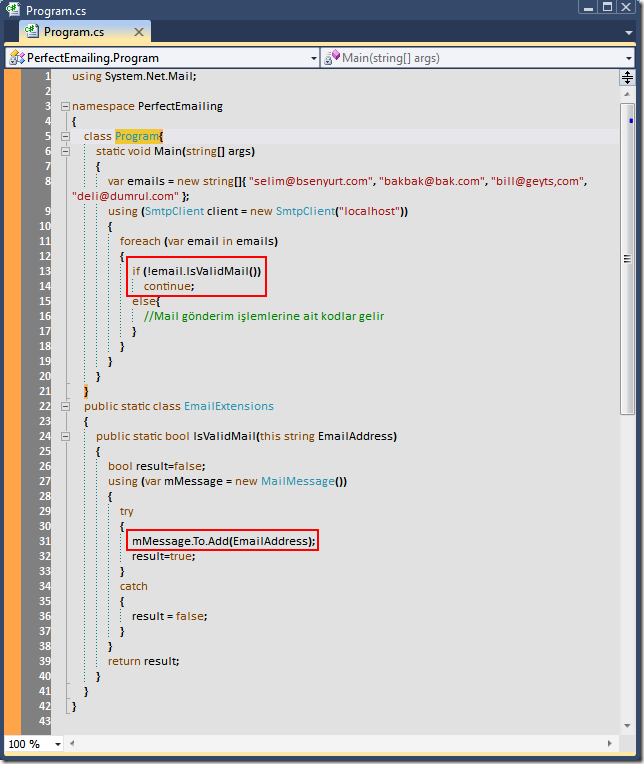

# Tek Fotoluk İpucu-44 (Mail Adresi Doğru mu?)
Merhaba Arkadaşlar,

Aslında bu soruya cevap vermek özellikle web developer'lar için son derece kolay. RegularExpressionValidator kontrolünde uygun deseni seçip kontole hatalı mail adresi girilmesi engellenebilir. Ama yine de bazen tedbiri elden bırakmamakta yarar vardır. Söz gelimi bir mail adres listesine toplu mail atacağımız bir senaryoyu göz önüne alalım. Geliştirdiğimiz kodlarda mail adreslerinin doğru olup olmadığını çok basit bir hile ile kontrol edebiliriz. Nasıl mı?

(Tabi bir yol da RegEx kullanmaktır bildiğiniz üzere. O yolun uygulanış biçimini de size bırakıyorum)

[PerfectEmailing.rar (21,55 kb)](assets/PerfectEmailing.rar)

ve isteyenler için VS Schema Settings dosyası:) [BurakSenyurtVsColorSchema.vssettings (280,59 kb)](assets/BurakSenyurtVsColorSchema.vssettings)
