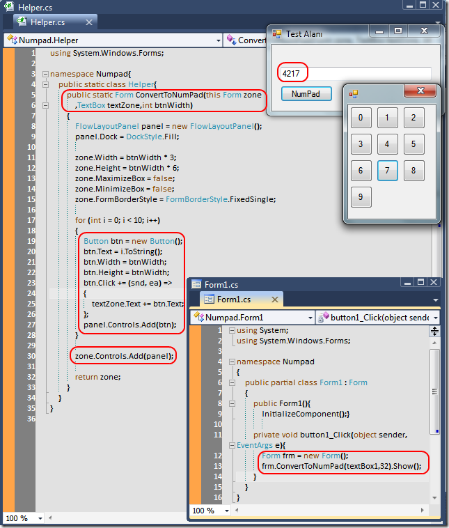

# Tek Fotoluk İpucu-45(NumPad Yapalım)
Merhaba Arkadaşlar,

Diyelim ki Windows Forms programlama ile ilgileniyorsunuz. Çalışma zamanında bileşen üretilmesini öğrendiniz. Form'lar arası geçişleri biliyorsunuz ve öğrendiklerinizi tatbik etmek niyetindesiniz. Hatta Extension Method kavramını da biliyorsunuz hatta Anonymous Method yazmayı da öğrendiniz. Öyleyse mesela bir NumPad formunun dinamik olarak üretilmesini ve üstündeki sayı düğmelerine basıldığında kaynak olarak gelen bir TextBox bileşeninin içinin doldurulmasını tecrübe etmeyi deneyebilirsiniz. Nasıl mı?

[Numpad.rar (38,02 kb)](assets/Numpad.rar)
