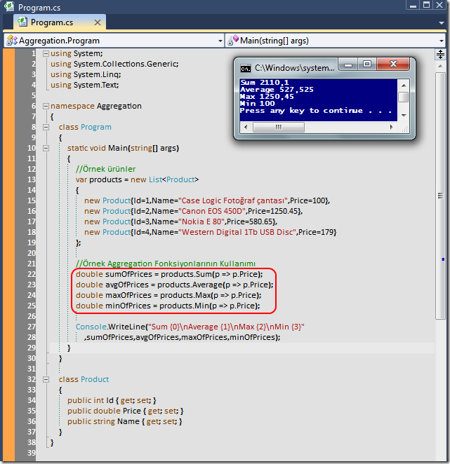

# Tek Fotoluk İpucu-46(LINQ Aggregate Fonksiyonları)
Merhaba Arkadaşlar,

LINQ tarafında Sum,Max,Min,Average gibi bazı hesaplama fonksiyonları vardır. Bunlara ait örnek bir kullanımı aşağıda bulabilirsiniz

[Aggregation.rar (22,75 kb)](assets/Aggregation.rar)
