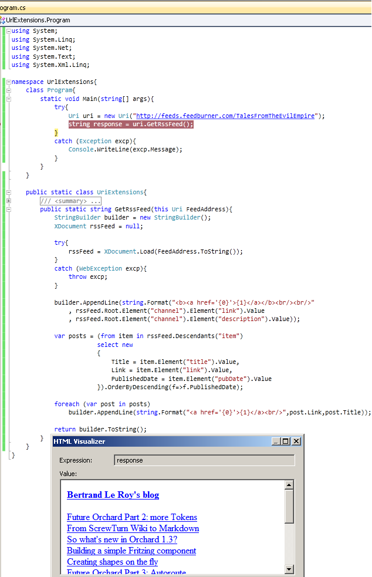

# Tek Fotoluk İpucu-48(Uri Extensions for RSS)
Merhaba Arkadaşlar,

Siz de benim gibi aklınıza geldikçe ve vaktiniz oldukça Extension Method (Genişletme Metodu) yazmaya çalışanlardan mısınız?

Geçtiğimiz gün Uri tipi için RSS Feed kaynağını okuyan ve gelen içeriği basit HTML formatı ile geriye döndüren bir genişletme metodu yazmaya çalıştım. Aynen aşağıda görüldüğü gibi

Size kalan ise bunun Atom formatı ile çalışan versiyonnu yazmak

