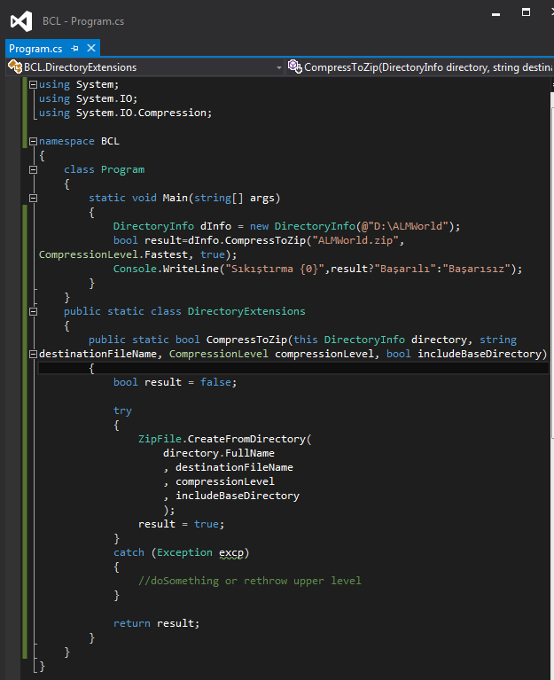
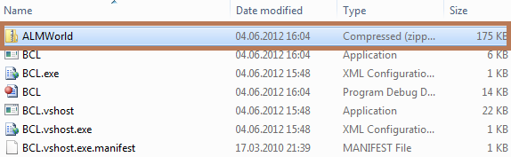

# Tek Fotoluk İpucu–54Buçuk
Merhaba Arkadaşlar,

Malum Visual Studio 2012 sürümünün RC sürümü geçtiğimiz hafta içerisinde yayınlandı ve internet üzerinden bu konu ile ilişkili yazılarda yayılmaya başlandı. Sadece Visual Studio 2012 değil ama.Net Framework 4.5 tarafında da epey önemli yenilikler geliyor. Ağırlık noktası her ne kadar paralel programlama tarafı ve doğal olarak async ile await anahtar kelimeleri olsa da, temel bazı yenilikler de var. Örneğin artık Zip formatında sıkıştırma desteği var. Söz gelimi bir klasör içeriğini ZIP formatında sıkıştıracak bir Extension metod yazmak istediniz

İşte buyrun.

> Not: System.IO.Compression.dll ile System.IO.Compression.FileSystem.dll referanslarını eklemek gerekiyor. Ayrıca örnek RC (Release Candidate) sürümüdür. Yani Release sürümde değişiklikler olabilir unutmayın
>
> 
