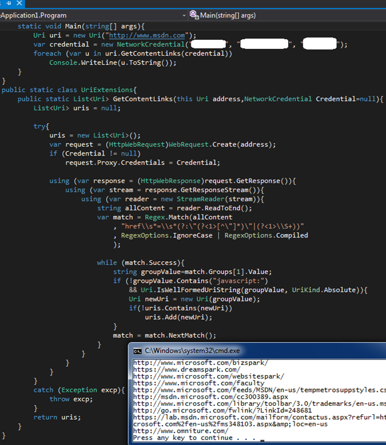

# Tek Fotoluk İpucu–65–Bir Web Sayfasının External Link’ lerini Yakalamak
Merhaba Arkadaşlar,

Diyelim ki her hangibir Uri tipinin işaret ettiği Web içeriğinde yer alan a href= takılarını yakalamak ve bir listeye doldurmak istediniz. Napardınız? Yoksa aşağıdaki gibi bir Extension Method mu geliştirirdiniz?

Sanırım Regex ifadesini farklı desenler (Pattern) ile denediğiniz de çok daha fazla bilgiye sahip olabildiğinizi görebilirsiniz

