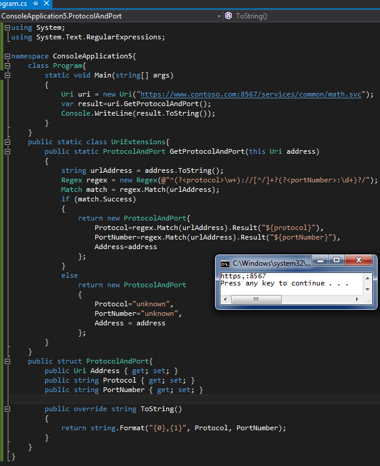

# Tek Fotoluk İpucu–66–Protokol ve Port Numarasını Bulmak
Merhaba Arkadaşlar,

Elimizde bir Uri nesne örneği olduğunu varsayalım. Bu Uri adres bilgisinden de port numarası ve protocol bilgisine ulaşmak istiyorsunuz. Aslında string tabanlı fonksiyonellikler ile bu iş gerçekleştirilebilir ama Regex tipini işin içerisine katar ve bir de Extension Method haline getirirsek tadından yinmez

Bir başka tek fotoluk ip ucunda görüşmek dileğiyle.
