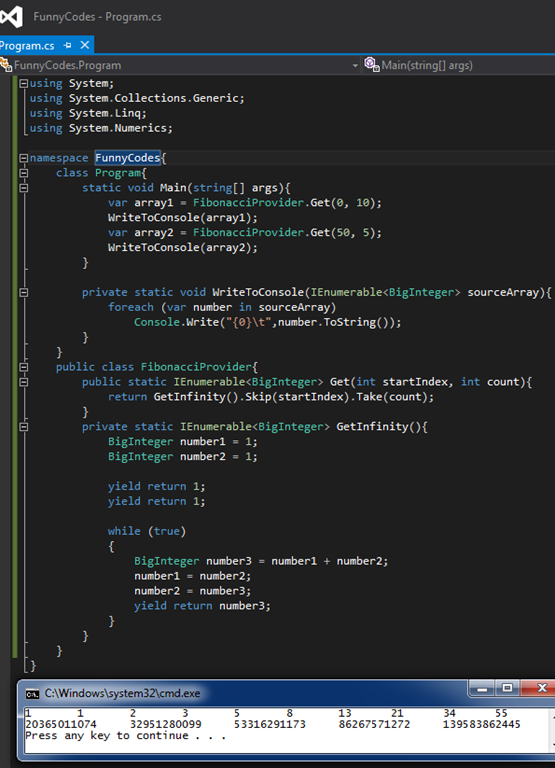

# Tek Fotoluk İpucu–67–Fibonacci, LINQ, Skip ve Take
Merhaba Arkadaşlar,

Biliyorsunuz.Net Framework 4.0 ile birlikte BigInteger tipi geldi ve çok büyük sayıları kullanabilir olduk. Şimdi diyelimki eğlencelik olsun diye Fibonacci sayılarının sonlu kümesine ve bu kümedende istediğiniz indexte başlayıp istediğiniz miktarda alabileceğiniz bir fonksiyonelliğe ihtiyacınız var. Ha bir de elinizin altında yield keyword’ ü. Taaaa.Net Framework 2.0 zamanlarından. Naparsınız?

Başka bir ipucundan görüşmek dileğiyle.
