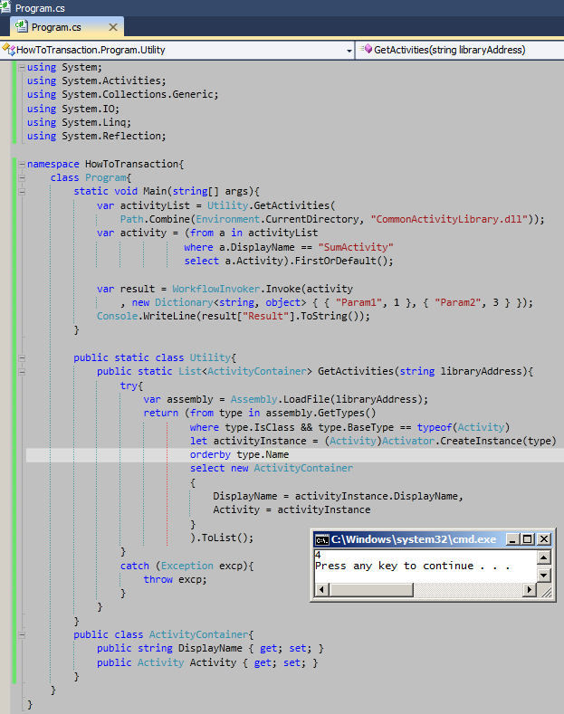

# Tek Fotoluk İpucu–68–Reflection ile Workflow Activity Yüklemek, Çalıştırmak
Merhaba Arkadaşlar,

Diyelim ki elinizde içerisinde bi dünya Workflow Activity’ si olan bir kütüphane var. Ancak bu kütüphane projenize referans edilmiş değil. Fiziki bir klasörde tutulmakta. Siz de istiyorsunuz ki, bu kütüphane içerisinde yer alan herhangibir Workflow Activity’ sini örnekleyebileyim ve hatta Workflow çalışma zamanı motoruna devredip yürütebileyim. Aşağı yukarı yapmanız gereken şeyin içerisinde Reflection olduğunu tahmin ediyorsunuzdur. Belki de aşağıdaki gibi bir yaklaşım hayal ediyorsunuzdur

[http://www.buraksenyurt.com/pics/tfi_68.png](images/tfi_68.png)SumActivity int tipinde, dışarıdan gelen iki argümanı toplayıp, sonucu yine bir argüman ile geriye döndüren akışı içermektedir.

Başka bir ipucunda görüşmek dileğiyle

