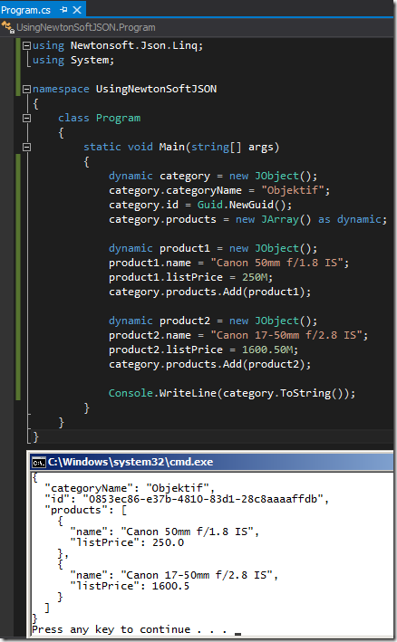

# Tek Fotoluk İpucu–69–Newtonsoft JSON.Net ve dynamic Keyword
Bildiğiniz üzere JSON (JavaScriptObjectNotation) oldukça kompakt bir veri formatı sunuyor. Çoğu durumda veriyi anlamlı şekilde saklarken, XML serileştirme yerine tercih ediyoruz. Nitekim daha az yer kaplamakla birlikte nesnel olarak anlaşılabilirliği daha yüksek. Özellikle MVC tarafında çok kıymetli. JSON ile.Net tarafında çalışırken ise işleri kolaylaştırmak adına Newtonsoft’ un NuGet ile indirebileceğimiz paketini kullanmaktayız.

> install-package newtonsoft.json

Şimdi düşünün ki elinizde C#’ ın dynamic gücü ve Newtonsoft’ un JSON.net kütüphanesi var. Sizce bir JSON nesnesini oluşturmak ne kadar zor olabilir

İşte bu kadar

Başka bir ipucunda görüşmek dileğiyle.
