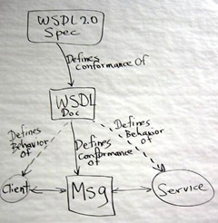
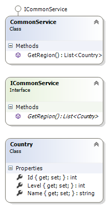
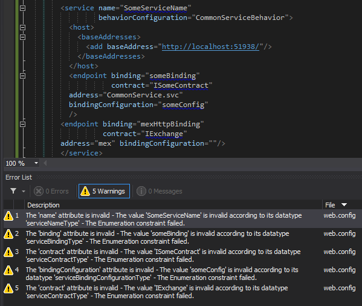
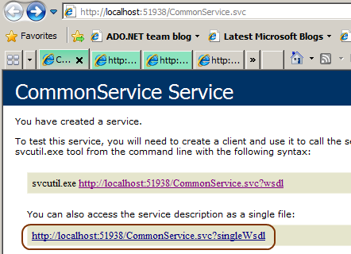
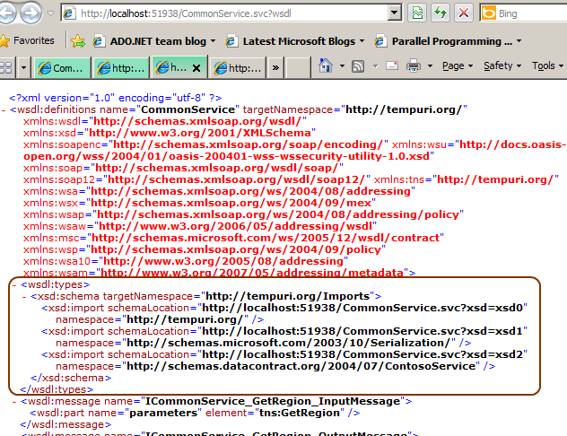
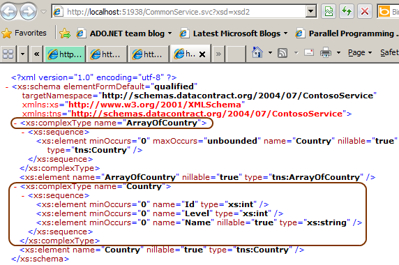
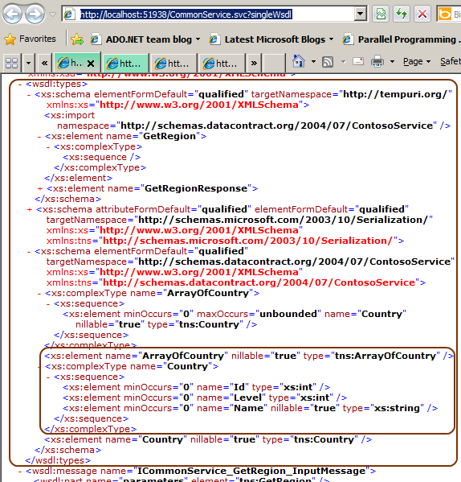
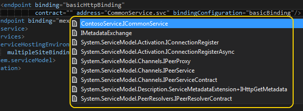

# WCF 4.5–SingleWSDL
[](images/what-wsdl-defines.jpg) Merhaba Arkadaşlar,

Daha dün gibi hatırlıyorum. Windows Communication Foundation 4.0 ile gelen yenilikleri inceliyor, öğrendiklerimi derhal bloğumda paylaşıyordum. Zaman ya çok hızlı akıyor ya da Microsoft zamanın önünde koşuyor


Nitekim.Net Framework 4.5 ha çıktı çıkacak derken, çoktan çıkmış da profesyonel projelerde kullanılmaya başlanmış bile.

Dolayısıyla zaman yine benim gibi aciz geliştiriciler için bir şeyleri daha öğrenme vaktidir. İşte ben de bu hevesle çok fazla makale tadında olmayan ama yeniliklerden haberdar olmamızı (en çok da balık hafızamın unuttuklarını kayıt almamı sağlıyor) sağlayacak bir kaç yazıya yer vermek istedim. İlk konumuz SingleWSDL


Windows Communication Foundation 4.5 sürümü ile birlikte gelen yeniliklerden birisi de WSDL içeriklerinin tekil bir dosya halinde elde edilebilme imkanıdır. SingleWSDL anahtar kelimesi sayesinde tek bir WSDL (Web Service Description Language) içeriğine, servis tarafının kullandığı tüm veri sözleşmelerinin (Data Contract) eklenmesi mümkündür.

> Bir WSDL içeriği ile, servisin hangi operasyonları sunduğu, bu operasyonlardan dönen tiplerin ne olduğu ve bu tiplerin şema yapılarının nasıl oluşturulması gerektiği öğrenilebilir. WSDL, XML dili ile üretilen bir servis tanımlama/keşfetme protokolüdür.

Bunun ne anlama geldiğini anlamak için dilerseniz basit bir örnek üzerinden ilerlemeye çalışalım. Bu amaçla Visual Studio 2012 ortamında bir WCF Service Application projesi oluşturalım. Proje içerisinde yer alan sözleşme ve diğer tipler aşağıdaki sınıf diagramında görüldüğü gibidir.

[](images/wcfnf_1.png)

ICommonService isimli servis sözleşmesi (Service Contract) içerisinde yer alan GetRegion isimli fonksiyon, Country tipinden elemanlardan oluşan bir listeyi döndürmekte olan servis operasyonunu tanımlamaktadır. Country tipi ise basit bir POCO olup aşağıdaki içeriğe sahiptir.

```csharp
namespace ContosoService 
{ 
    public class Country 
    { 
        public int Level { get; set; } 
        public string Name { get; set; } 
        public int Id { get; set; } 
    } 
}
```

Servis sözleşmesi ve uygulayıcı tip içerikleri ise şu şekildedir.

Servis sözleşmesi;

```csharp
using System.Collections.Generic; 
using System.ServiceModel;

namespace ContosoService 
{ 
    [ServiceContract] 
    public interface ICommonService 
    { 
        [OperationContract] 
        List<Country> GetRegion(); 
    } 
}

using System; 
using System.Collections.Generic;

namespace ContosoService 
{ 
    public class CommonService 
        : ICommonService 
    { 
       public List<Country> GetRegion() 
        { 
            List<Country> asiaRegion = new List<Country> 
            { 
                new Country{Id=1,Name="Japan",Level=100}, 
                new Country{Id=2,Name="S. Korea",Level=200}, 
                new Country{Id=3,Name="Singapur",Level=300} 
            }; 
            return asiaRegion; 
        } 
    } 
}
```

> Bonus Yenilik:
> WCF 4.5 konfigurasyon içeriklerinde doğrulama (Validation) artık daha etkili ve kabiliyetli. Aşağıdaki şekilde yer alan Warning mesajlarına dikkat
>
> 
> [](images/wcfnf_8.png)

Amacımız WSDL çıktılarına bakmak olduğundan sadece POCO (Plain Old CLR Object) tip kullanan bir Dummy servis geliştirdiğimizi düşünebiliriz. Şu noktada servisi tarayıcı uygulamadan çağırdığımızda aşağıda görülen ekran çıktısı ile karşılaşırız.

[](images/wcfnf_2.png)

Dikkat edileceği üzere WSDL içeriklerine iki farklı adres ile talepte bulunabiliriz. Üstte yer alan http://localhost:51938/CommonService.svc?wsdl adresinden yapılan standart sorgu, bildiğimiz WSDL çıktısını döndürecektir ki söz konusu içerik aşağıdaki gibidir.

[](images/wcfnf_3.png)

Şimdi burada duralım. Servisimiz bilindiği üzere Country tipi ile çalışacak şekilde tasarlanmıştır. Dolayısıyla istemci tarafı için gerekli proxy üretimi sırasında bu tipinde karşı tarafta oluşturulması gerekir. Bunun içinse ilgili tip tanımlamalarının WSDL dökümanında bulunması şarttır ki, svcutil aracı veya Add Service Reference seçeneği hangi şemaya bakarak nasıl bir sınıf üreteceğini bilsin.

Yukarıdaki ekran görüntüsüne bakıldığında XSD (Xml Schema Definition) tanımlamaları için harici referanslar verildiği de görülmektedir. Söz gelimi http://localhost:51938/CommonService.svc?xsd=xsd2 talebi gerçekleştirildiğinde aşağıdaki ekran görüntüsünde yer alan çıktıya ulaşılır.

[](images/wcfnf_4.png)

Fark edileceği üzere bu XSD içeriğinde Country tipi ve Country tipinden oluşan dizi tanımı (ArrayOfCountry) söz konusudur. Bu şema da Country tipinin içerdiği özellikler (Properties) ve bu özelliklerin tipleri yer almaktadır.

Şimdi de http://localhost:51938/CommonService.svc?singleWsdl adresi için yapılan talebin sonuçlarına bakalım.

[](images/wcfnf_5.png)

Görüldüğü gibi servis tarafının kullandığı veri sözleşmesi (Data Contract) ve gerekli diğer tip tanımlamaları aynı WSDL dökümanı içerisine bir element ağacı olarak entegre edilmiştir. Bir başka deyişle XSD kaynaklarının harici URL adresleri üzerinden referans edilmediği, bunun yerine aynı döküman içerisine enjekte edildikleri görülmektedir.

WCF 4.5 tarafında gelmiş olan bir kaç yenilik daha bulunmaktadır. Genelde çok küçük ve pek de göze çarpmayacak yenilikler olmasına rağmen, önemlidirler. Söz gelimi configurasyon dosyası içerikleri için doğrulama (Validation) kabiliyetleri arttırılmış, IIS için otomatik HTTPS end point tanımlaması getirilmiş, WebSockets üzerinden haberleşme imkanı sunulmuş vb…Bu tip yenilikleri kısa kısa da olsa paylaşmaya çalışıyor olacağım. Tekrardan görüşünceye dek hepinize mutlu günler dilerim.

> Bonus Yenilik:
> WCF konfigurasyon dosyası üzerinde artık daha fazla hakimiyetimiz var. Eğer sizlerde benim gibi WCF Service Configuration Editor yerine config dosyası içerisinde ilerleyenlerdenseniz özellikle intelli-sense desteğinin eksik olmasından yakınanlardansınızdır.
> Ancak WCF 4.5 ile bu konuda önemli avantajlarımız var. Örneğin hatırlayamadığımız veya içeride hangi sözleşme var bilmediğimiz durumlarda intelli-sense yardımımıza yetişiyor. Aşağıdaki ekran görüntüsünde olduğu gibi
>
> 
> [](images/wcfnf_7.png)

[ContosoService.zip (23,61 kb)](assets/ContosoService.zip)
