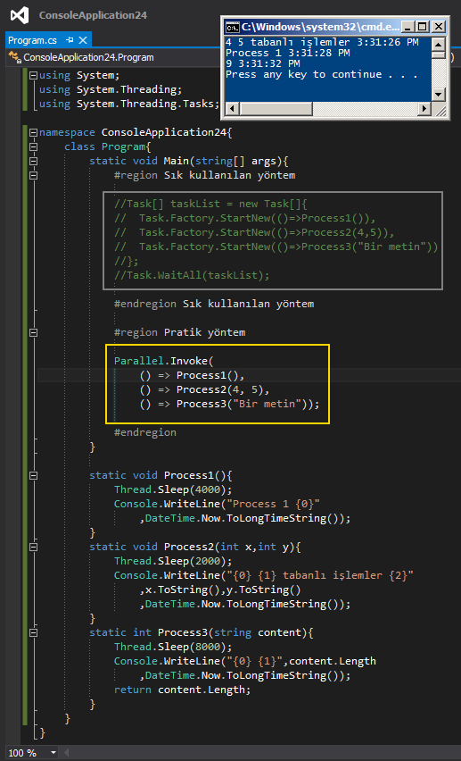

# Tek Fotolok İpucu 88–Task.WaitAll out, Parallel.Invoke in
Merhaba Arkadaşlar,

Bildiğiniz üzere paralel çalışmasını istediğimiz görevler olduğunda genellikle bunları birer Task halinde üretir ve bir dizi içerisinde toplarız (En azından TPL-Task Parallel Library geldikten sonra böyle yapmakta olduğumuzu ifade edebiliriz) Görevleri Task tipinden bir dizi içerisinde toplamamızın sebebi ise genellikle WaitAll gibi bir çağrıya ihtiyaç duyabilecek olmamızdır.

Ancak bunun daha pratik olan bir yolu da vardır. O da Parallel sınıfı üzerinden erişilebilen Invoke metodudur. Bu metod birden fazla Action örneğini parametre olarak alabilir, çalıştırabilir ve hatta tamamı sonlanıncaya kadar kod satırını duraksatabilir. Nasıl mı? Aynen aşağıda görüldüğü gibi

Bir başka ipucunda görüşmek dileğiyle

