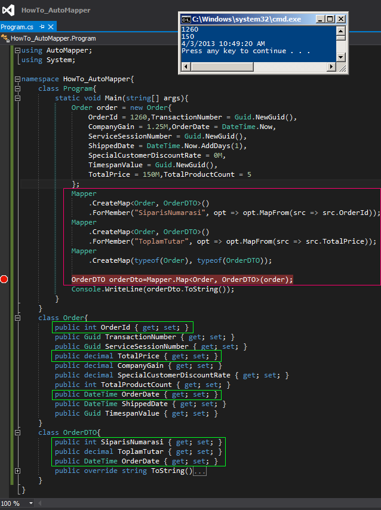

# Tek Fotoluk İpucu 100–AutoMapper Kullanımı
Merhaba Arkadaşlar,

Bildiğiniz üzere [şu yazımızda](http://www.buraksenyurt.com/post/Tek-Fotoluk-Ipucu-99-Tipler-Arasi-Property-Eslestirme) nesneler arası özellik (Property) eşleştirmelerinin nasıl yapılabileceğini incelemeye çalışmıştık. Ancak işin çok daha profesyonel bir boyutu var. Örneğin tipler arası özellik adları birbirlerinden farklı olabilir ve bu nedenle bir haritayı önceden söylemeniz gerekebilir. Neyseki NuGet üzerinden yayınlanan AutoMapper kütüphanesi çok gelişmiş özellikleri ile buna imkan vermektedir. Söz gelimi aşağıdaki fotoğraf özellik adlarının farklı olması halinde bile AutoMapper ile başarılı bir şekilde eşleştirme yapılabileceğini göstermektedir.

Denemeden önce en azından install-package AutoMapper komutunu Package Manager Console’ dan çalıştırıp ilgili kütüphaneyi yüklemeyi unutmayınız.
