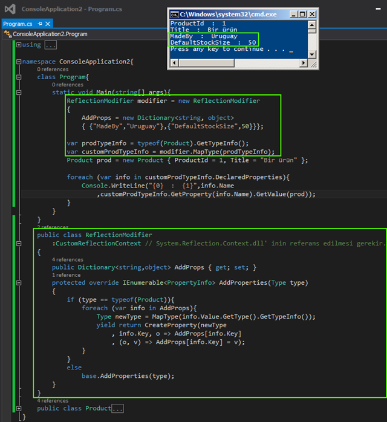

# Tek Fotoluk İpucu 104 : CustomReflectionContext ile Tipe Özellike Kazandırmak
Bir tipin çalışma zamanında Reflection ile yakalanabilen özelliklerine ilaveler yapmak ister miydiniz? Aslında bunun çok kolay bir yolu var. Tek yapmanız gereken CustomReflectionContext tipinden yeni bir sınıf üretmek ve bunu aşağıdakine benzer bir şekilde kullanmak

Bir başka ipucunda görüşmek dileğiyle, hepinize mutlu günler dilerim

