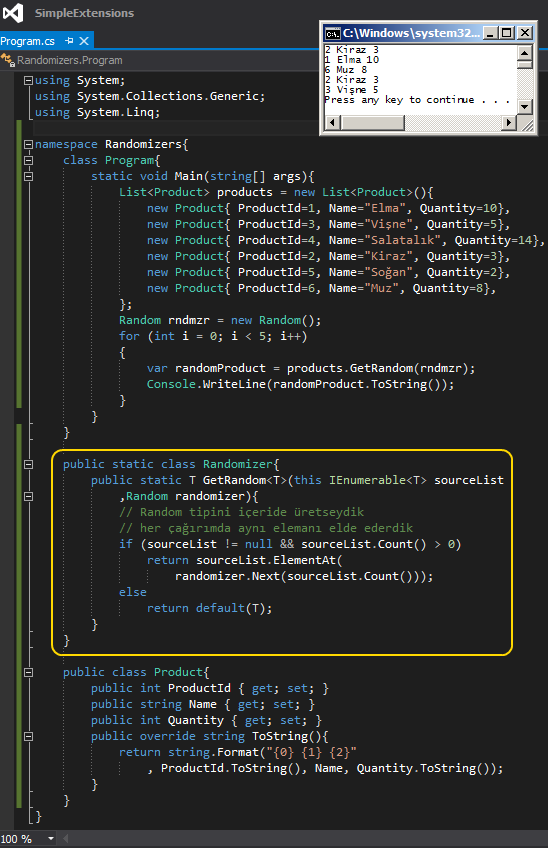

# Tek Fotoluk İpucu 75–LINQ ile Rastgele Eleman Çekmek
Merhaba Arkadaşlar,

Pek çoğumuz Random tipini kullanır ve bir listeden rastgele elemenalar üretmeye veya elde etmeye çalışırız. Peki T tipinden bir listeden herhangibir anda rastgele eleman almak isteseniz ve bunu bir Extension metod olarak tasarlamayı planlasanız...Nasıl bir yol izlerdiniz?

Aşağıdaki gibi olabilir mi mesela?

Bir başka ip ucunda görüşmek dileğiyle.
