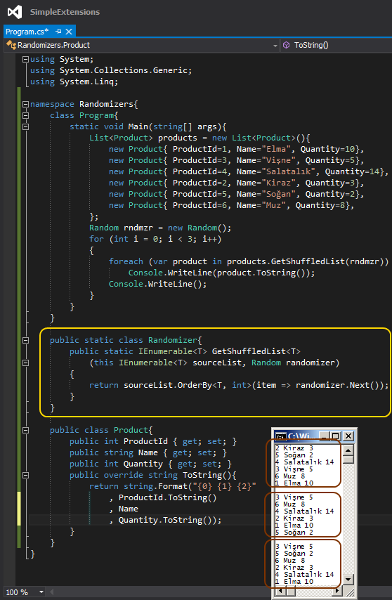

# Tek Fotoluk İpucu 76–Bir Listeyi Shuffle’ lamak
Merhaba Arkadaşlar,

Malum hepimizin devasaaa/kocaman boyutlarda MP3 arşivleri var ve genelde müzik dinlerken de uygulamaların shuffle özelliklerini açarak, karışık sırada dinlemeyi tercih ediyoruz. Peki kendi tiplerinize ait generic bir listeyi Shuffle’ layarak kullanmak isteseydiniz, nasıl bir yol izlersiniz? Aşağıdaki gibi olabilir mi?

Bir başka ipucunda görüşmek dileğiyle.
