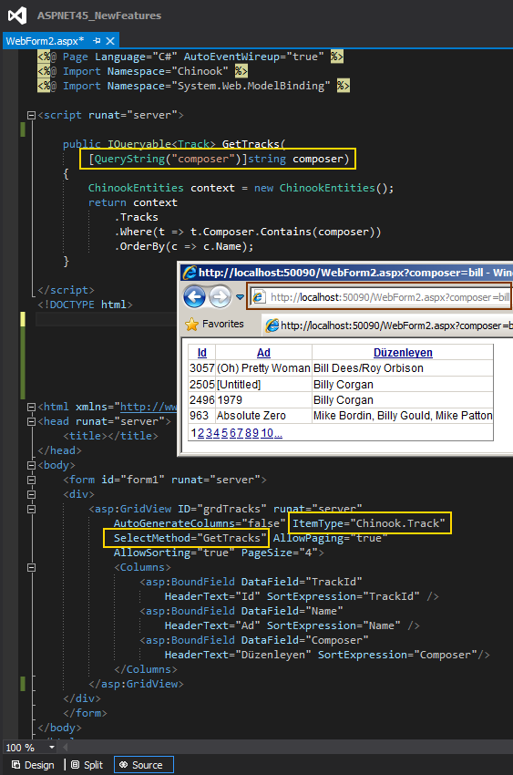

# Tek Fotoluk İpucu 77–Asp.Net 4.5 QueryStringAttribute
Merhaba Arkadaşlar,

Asp.Net 4.5 tarafında gelen yeniliklerden birisi de System.Web.ModelBinding isim alanı altında yer alan ve metod parametrelerine uygulanan QueryString niteliğidir (Attribute). Bu nitelik ile bir metodun parametre değerinin, URL Querystring üzerinden okunabileceği ifade edilmektedir.

Özellikle veri bağlı kontrollerin (GridView gibi), IQueryable benzeri referanslar döndüren metodlar ile ilişkilendirildikleri senaryolarda, query string yardımıyla filtreleme yapılmasında kullanılır. Aynen aşağıdaki fotoğrafta görüldüğü gibi

Bir başka ipucunda görüşmek dileğiyle

