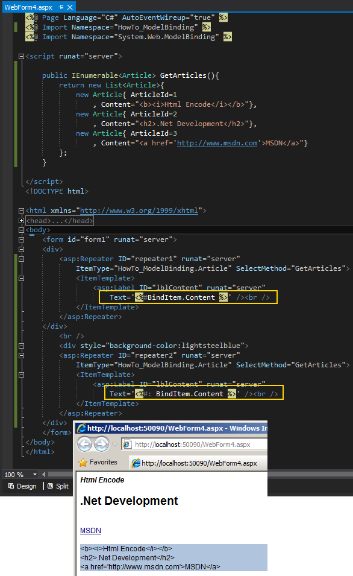

# Tek Fotoluk İpucu 78 - Asp.Net 4.5 ile HtmlEncode
Merhaba Arkadaşlar,

Bazı durumlarda Asp.Net sayfasının çıktısına basacağımız içeriğin HTML formatlı elementlerinin Text tabanlı görünümleri olmasını isteriz. Örneğin takısının, uygulandığı metni bold olarak göstermesini istemeyiz. Bunun yerine yazı şeklinde düz metin olarak gösterilmesini arzu ederiz (Hatta bazı blogların yorum kısımlarında, yorumda kullanılabilecek HTML Tag'leri ifade edilir. Ama metin olarak basılmışlardır) Bunun için Asp.Net 4.5 tarafında işimizi oldukça kolaylaştıracak bir özellik yer almakta. İki nokta üst üste işaretini kullanmamız HTML içeriğinin metinsel olarak kullanılmasında yeterli oluyor. Nerede mi? Özellikle Veri bağlama (Data Binding) noktalarında

Örneğin,

Bir başka ip ucunda görüşmek dileğiyle

