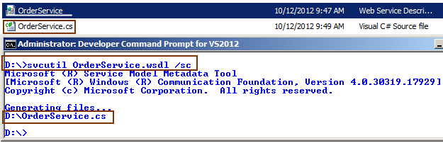
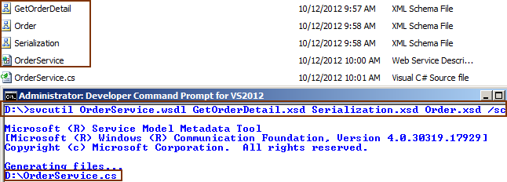

# Tek Fotoluk İpucu 79– svcutil ile Contract-First Development
Merhaba Arkadaşlar,

WCF 4.5 tarafında gelen yeniliklerden birisi de svcutil komut satırına eklenen servicecontract (ya da kısa haliyle sc) parametresidir. Bu parametre sayesinde bir WSDL dokümanından (ve beraberinde kullandığı XSD’ ler var ise onlardan) servis sözleşmesinin (Service Contract) elde edilebilmesi mümkündür. Tek yapmanız gereken aşağıdakine benzer şekilde sc parametresini kullanmanız olacaktır.

Bu örnekte WSDL dökümanı XSD’ leri de bünyesinde barındırmaktadır. Eğer XSD’ ler harici dosyalarda tutulmaktaysalar onları da komut satırında belirtmeniz gerekecektir. Aşağıdaki fotoğrafta görüldüğü gibi

Başka bir ipucunda görüşmek dileğiyle

