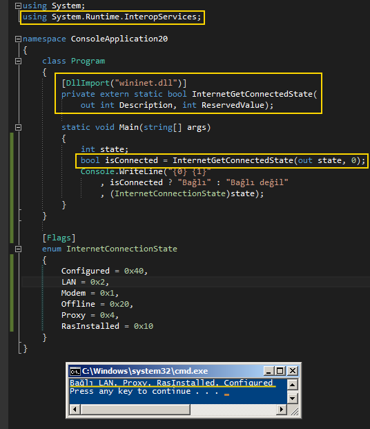

# Tek Fotoluk İpucu 81–Internete Bağlı mıyız?
Merhaba Arkadaşlar,

Acaba çok basit ve hızlı bir şekilde internete bağlı olup olmadığımızı nasıl kontrol edebiliriz, hiç düşündünüz mü? Bunun pek çok yolu var aslında. Ancak bir tanesi oldukça hızlı. Basit bir WinAPI yardımıyla bu fonksiyonelliği sağlayabilir ve internete bağlı olup olunmadığını kontrol edebiliriz. Aynen aşağıdaki ekran görüntüsünde yer alan kod parçasında olduğu gibi

Bir başka ip ucunda görüşmek dileğiyle

