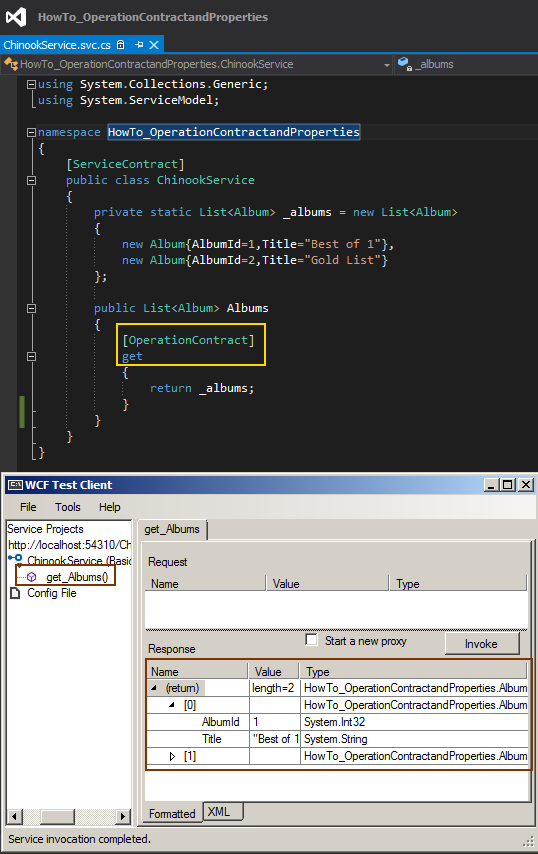

# Tek Fotoluk İpucu 84–WCF içerisinde Property Kullanımı
Merhaba Arkadaşlar,

Malum bildiğiniz üzere get ve set bloklarından oluşan özellikler (Properties) aslına bakarsanız arka planda (IL-Intermediate Language) birer metod olarak ifade edilirler. Bu teoriden yola çıkarsak bir servis içerisine özellik (Property) yazıp get,set metoldarını operasyon olarak dış dünyaya sunabiliriz

Nasıl mı? Aynen aşağıdaki fotoğrafta görüldüğü gibi.

Gördüğünüz gibi ReadOnly olarak tanımlanmış bir Property, OperationContract niteliği ile işaretlenen get metodunu dışarıya operasyon olarak sunabilmekte. Bir başka ipucundan görüşmek dileğiyle

