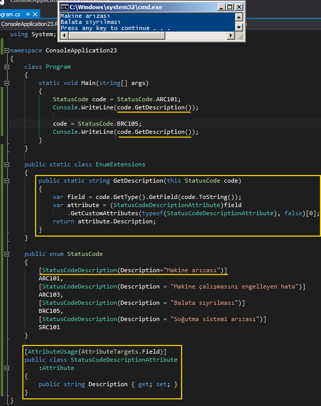

# Tek Fotoluk İpucu 87–Enum Sabitleri ile Attribute Kullanımı
Merhaba Arkadaşlar,

Bazen uygulamalarımızda kullandığımız Enum sabitlerinin içerikleri anlaşılabilir kelimelerden oluşmayabilir. Örneğin AR101,BR103 isimli Enum değerleri çalışma zamanında nasıl yorumlanabilirler. Mantıklı isimler verebilecek olsak da bazen bu değerler sistemin kendisi için anlamlı olabilirler. Ancak dilerseniz enum sabiti değerlerini, kendi geliştireceğiniz nitelikler (Attribute) ile donatabilir ve çalışma zamanına ek bilgiler sunabilirsiniz. Hem de basit bir extension metod yardımıyla bu fonksiyonelliğin kolayca ulaşılabilir olmasını sağlayabilirsiniz. Nasıl mı? İşte size bir örnek

Bir başka ipucunda görüşmek dileğiyle

