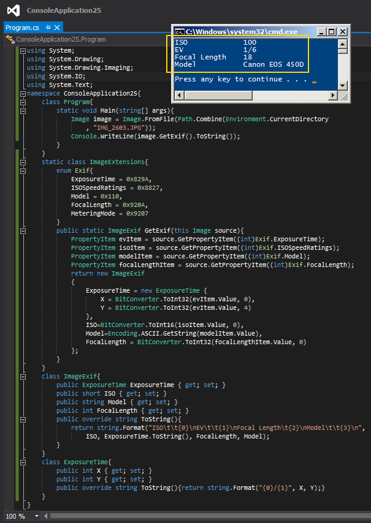

# Tek Fotoluk İpucu 89–Exif Bilgilerini Okumak
Merhaba Arkadaşlar,

Takip edenler amatör düzeye yaklaşmaya çalışan/çabalayan fotoğrafçılık tutkunu birisi olduğumu bilirler. Hatta okullarda “Fotoğrafçı ve Hataları…” konulu bir ders konusu olabilecek kadar iddialı bir foto bloğumda da bulunmaktadır

Bu bloğa fotoğraf yüklerken her seferinde yapmak zorunda olduğum ama bundan çok fazla derecede sıkıldığım bir işlemde fotoğrafların exif bilgilerini öğrenip yazmaktır. Oysaki Image tipine eklenebilecek bir Extension metod ve fotoğrafa ait bazı özellik bilgilerinden yararlanarak ISO, EV, Focal Length gibi istediğim temel bilgilere ulaşabilirim. Nasıl mı? Aynen aşağıdaki fotoğrafta görüldüğü gibi

Bir başka ipucunda görüşmek dileğiyle.
