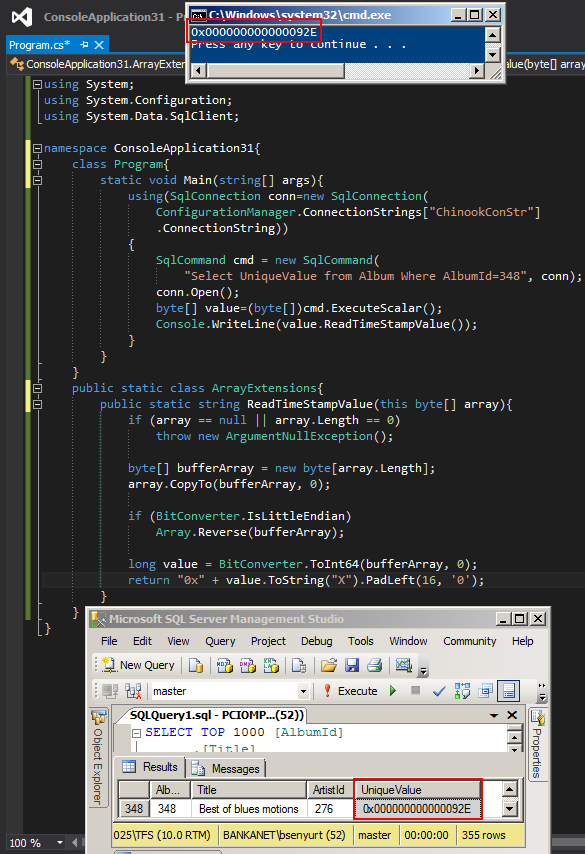

# Tek Fotoluk İpucu 91–Timestamp Veriyi String Olarak Okumak
Merhaba Arkadaşlar,

Diyelim ki SQL Server üzerinde duran tablolarda timestamp veri tipinden alanlar bulunmakta ve siz bu alanları belki bir Backoffice uygulamasında belki bir admin panelde, kullanıcalara göstermek istiyorsunuz. Normal şartlarda bilindiği üzere bu alan bir byte[] array olarak elde edilmektedir. Dolayısıyla timestamp içeriği taşıyan bu byte[] array’ in anlamlı bir string tipine dönüştürülmesi okunurluğu açısından şarttır. Ne yaparsınız? Belki basit bir extension method’ u bu amaçla projeye dahil edebilirsiniz. Aynen aşağıda görüldüğü gibi.

Bir başka ipucunda görüşmek dileğiyle

