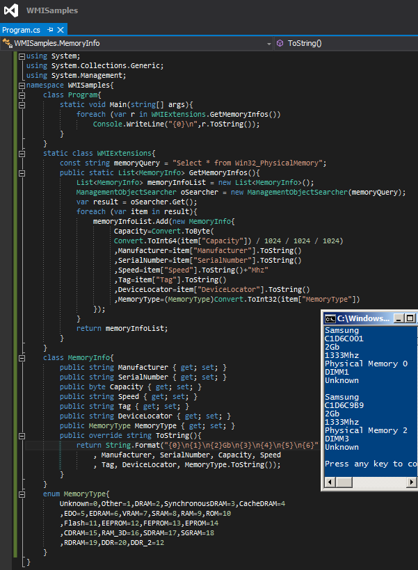

# Tek Fotoluk İpucu 92–WMI ile RAM Bilgilerini Almak
Merhaba Arkadaşlar,

Diyelim ki uygulamanız içerisinden, çalışmakta olduğu Windows işletim sistemi tabanlı makinenize ait fiziki RAM bilgilerini almak istiyorsunuz. Örneğin markasını, hangi slota takılı olduğunu, boyutunu, tipini vs…

Bu amaçla kullanabileceğiniz etkili yöntemlerden birisi de bildiğiniz üzere WMI (Windows Management Instrumentation) alt yapısından yararlanmaktır. Aslında tek yapmanız gereken ANSI-SQL standartlarının bir alt kümesi olan basit bir WQL (WMI Query Language) ifadesi kullanmaktır. Nasıl mı? Aynen aşağıdaki fotoğrafta görüldüğü gibi

Örneğin benim sistemimde 2 adet Samsung marka 2Gb RAM varmış. Tipleri Unknown gelse de biraz fikir sahibi oldum diyebilirim. Bir başka ipucundan görüşmek dileğiyle

