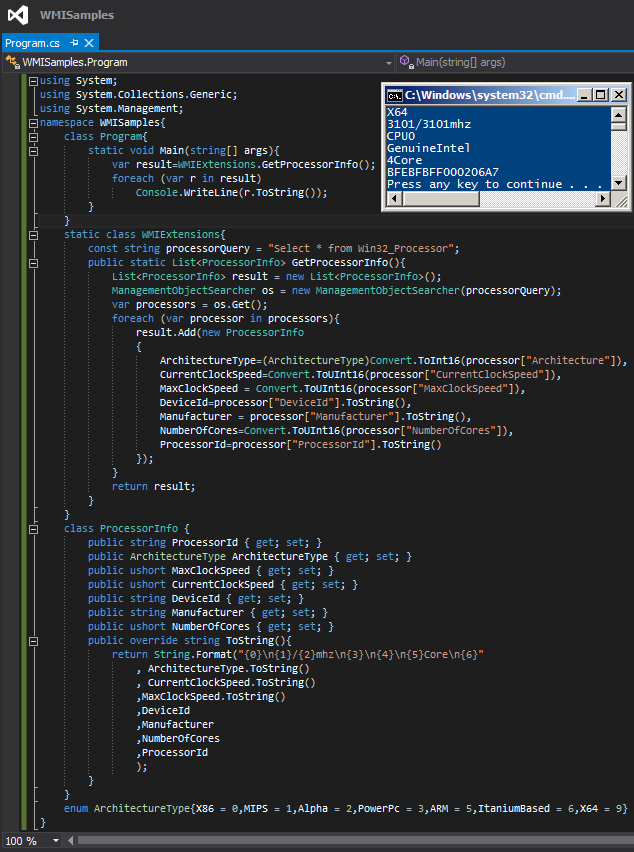

# Tek Fotoluk İpucu 93–WMI ile Processor Bilgisini Okumak
Merhaba Arkadaşlar,

Hatırlayacağınız üzere bir önceki Tek Fotoluk İpucunda, Win32PhysicalMemory isimli WMI (Windows Management Instrumentation) tipinden yararlanarak, makinede takılı olan RAM’ ler hakkında temel bilgileri nasıl alabileceğimizi incelemiştik. Bu seferki ipucumuzda ise işlemci bilgilerini okumaya çalışıyor olacağız. Aşağıdaki fotoğrafta görüldüğü gibi.

Bu arada Win32_Processor tipi için kullanabileceğiniz diğer özellikleri de [bu adresten bulabilir ve deneyebilirsiniz](http://msdn.microsoft.com/en-us/library/windows/desktop/aa394373(v=vs.85).aspx). Bir başka ipucunda görüşmek dileğiyle

