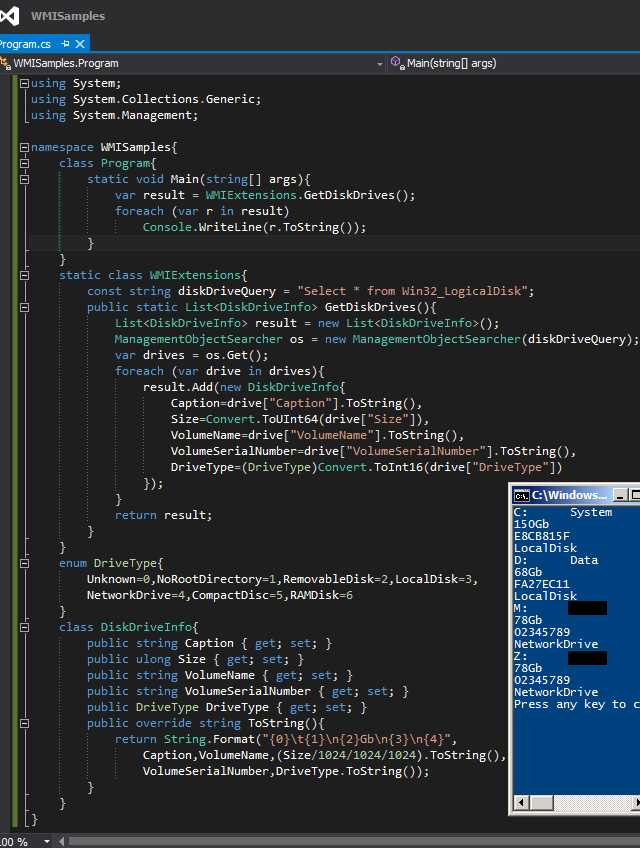

# Tek Fotoluk İpucu 94–WMI ile Disk Bilgilerini Okumak
Merhaba Arkadaşlar,

WMI (Windows Management Instrumentation) maceralarımıza devam etmeye ne dersiniz? Eğer biraz daha kasarsak, geniş bir WMI kütüphanesi bile oluşturabiliriz. Bu fotoğrafımıza konu olan güncel senaryomuz ise şöyle; İşletim sistemi tarafından Map edilmiş Disk bilgilerine nasıl ulaşabiliriz? Sadece Hard Disk’ ler değil. Bağlı olduğumuz Network Driver’ ları da öğrenmek istediğimizi varsalayım

Dilerseniz önce WMI tarafında önceki ipuçlarımızdan da yararlanarak senaryoyu gerçekleştirmeye çalışın. Sonrasında fotoğrafımıza bakarsınız.

Tabi Win32LogicalDisk tipinin kullanılabilecek farklı özellikleri de mevcut. Bu özelliklere de [şu adresten](http://msdn.microsoft.com/en-us/library/windows/desktop/aa394173(v=vs.85).aspx) bakabilirsiniz. Bir başka ipucundan görüşmek dileğiyle

