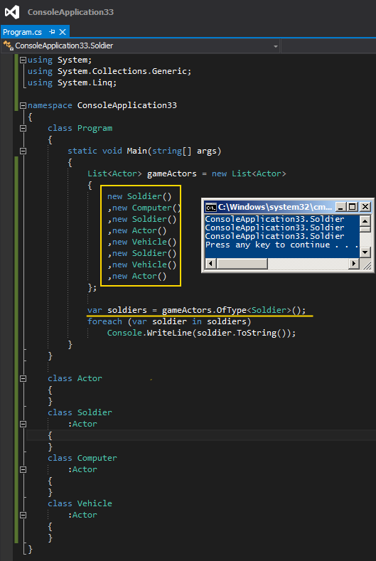

# Tek Fotoluk İpucu 95–OfType<T>
Merhaba Arkadaşlar,

LINQ (Language INtegrated Query) tarafını her ne kadar yoğun kullanıyor olsak da gözümüzden kaçırdığımız, dikkat etmediğimiz, yerine yeni geliştirmeler yaptığımız ama aslında bizim kullanmamızı bir köşede bekleyen fonksiyonlar vardır.

Örneğin kalıtımsal ilişki içerisinde olan Actor, Soldier, Computer, Vehicle tiplerini düşünün. Hatta bu tipler arasında, Soldier bir Actor’ dür, Computer’ de bir Actor’ dür ve hatta Vehicle’ da bir Actor’ dür şeklinde is-a ilişkisi olduğunu düşünelim.

Peki elinizde Actor tipinden bir liste varsa ve bir an gelipte içinden sadece Soldier olanları çekmek isterseniz, ne yaparsınız? Aşağıdaki gibi bir kullanım işinize yarayabilir mi acaba?

Bir başka ipucunda görüşmek dileğiyle.
