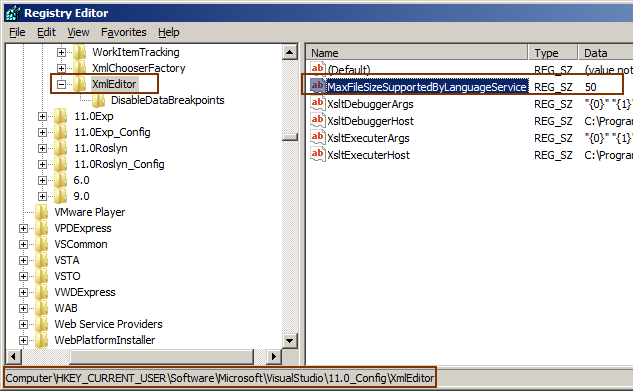

# Tek Fotoluk İpucu 96–10Mb Üstü XML Dosyaları
Merhaba Arkadaşlar,

Geçtiğimiz günlerde bloğumdaki içeriği yedeklemek için dışarı aktardım. Yaklaşık olarak 20Mb büyüklüğündeki XML içeriğini, sonrasında Visual Studio 2012 ile açıp incelemek istedim (Daha önceden de yaptığım bir işti. Genellikle [Almanac](http://www.buraksenyurt.com/post/Burak-Senyurt-Almanac-2012-Hazc4b1r.aspx)’ ı üretmek için kullanıyorum) Ancak bulunduğu ortamdaki Visual Studio 2012, 10 Mb üstü XML içeriğini açamayacağını, ille de açmak istiyorsam Registery’ de bu konu ile ilişkili değeri değiştirme gerektiğini söyledi. Sonuç olarak aşağıdaki düzenlemeyi yaparak bu kısıtlamayı aşabilirsiniz.

Bir başka ipucunda görüşmek dileğiyle

