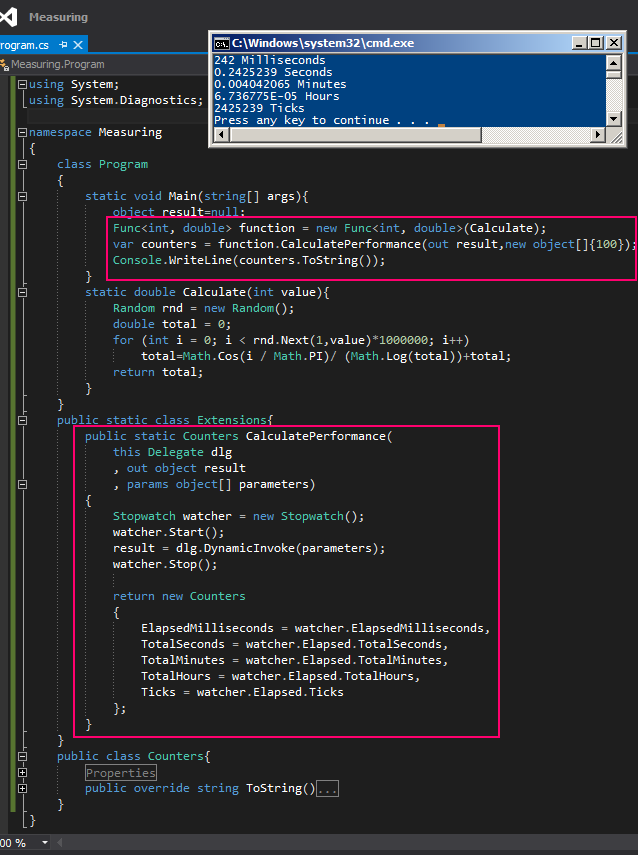

# Tek Fotoluk İpucu 98–Stopwatch ile Performans Ölçümü
Merhaba Arkadaşlar,

Diyelim ki elinizde çeşitli tipte ve sayıda fonksiyon var ve bunların çalışma zamanındaki işleyiş sürelerini hesaplamak istiyorsunuz. Normal şartlarda her metoda gidip DateTime tipini ele alarak süre ölçümleri yapabiliriz. Ya da Delegate sınıfına bir genişletme fonksiyonu yazarak sorunu halletmeye çalışırız. Aynen aşağıdaki ekran görüntüsünde olduğu gibi.

Bir başka ipucunda görüşmek dileğiyle hepinize mutlu günler dilerim.
